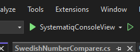

# Changing connection-strings:
If your connectionstrings does not fully match mine then one would need to change them both in:  
./Entities/appsettings.json 
And: 
./SystematiqConsoleView.Programs

# On change of **/Entities:
Navigate into Entities and execute following command in terminal: 
dotnet ef migrations add InitialMigration

Followed by: 
dotnet ef database update

# To run the application:
1. Install all nuget packages.
2. Open a terminal and navigate into Entities and execute following command in terminal: dotnet ef database update
3. Open visual studio and start the application using this button:  